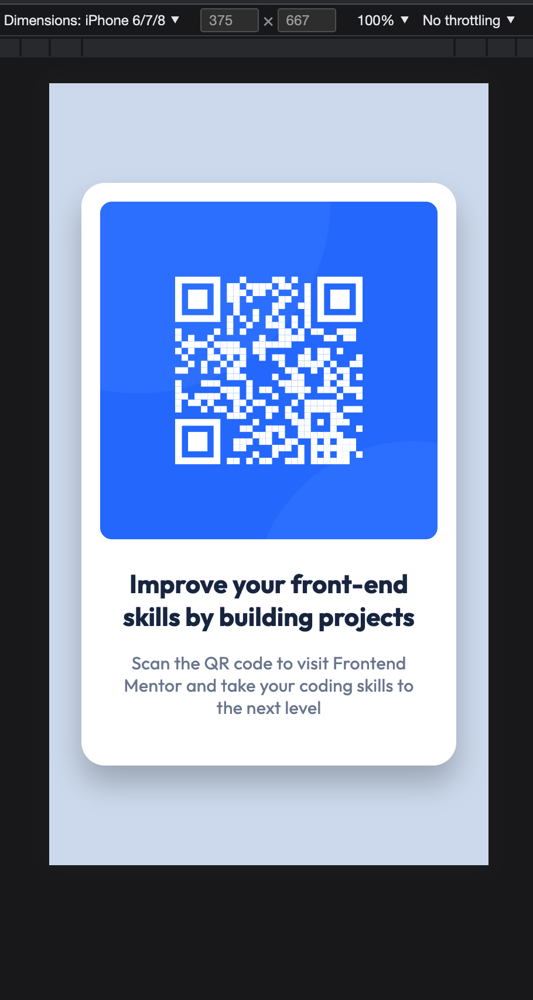
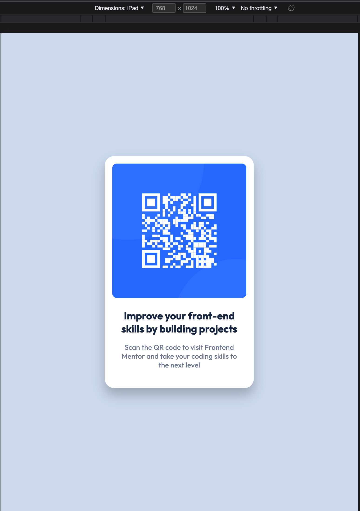
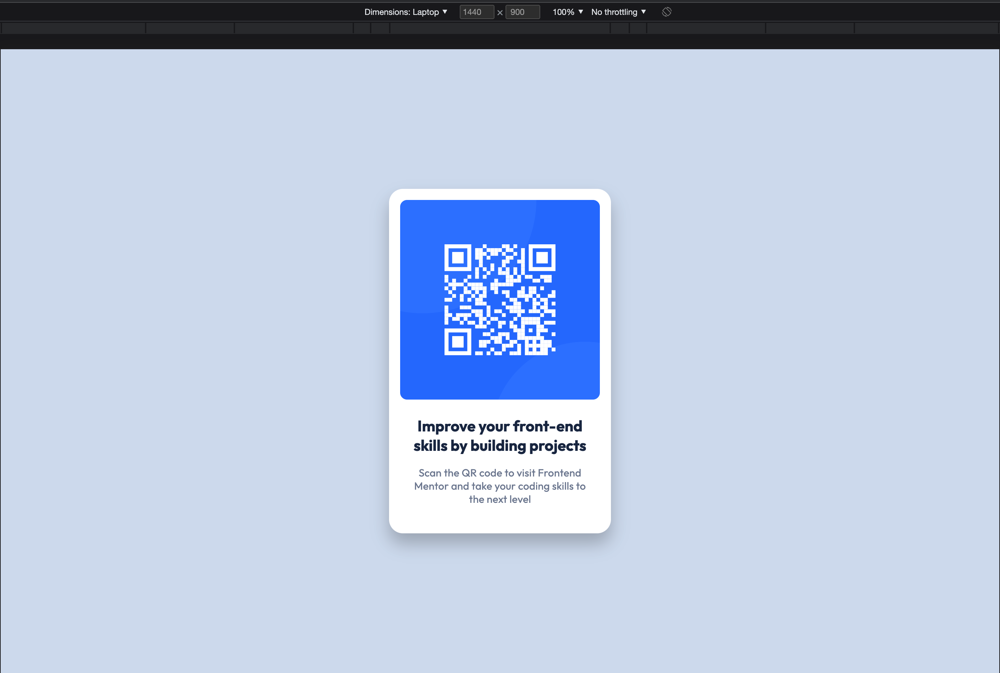
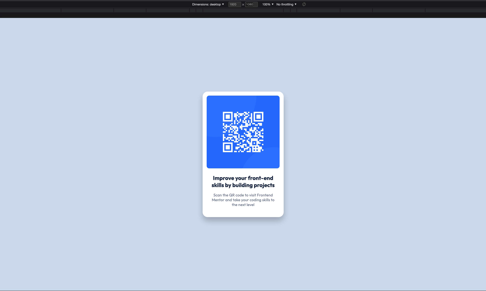

# Frontend Mentor - QR code component solution

This is a solution to the [QR code component challenge on Frontend Mentor](https://www.frontendmentor.io/challenges/qr-code-component-iux_sIO_H). Frontend Mentor challenges help you improve your coding skills by building realistic projects.

## Table of contents

- [Overview](#overview)
  - [Screenshots](#screenshot)
  - [Links](#links)
- [My process](#my-process)
  - [Built with](#built-with)
  - [What I learned](#what-i-learned)
  - [Continued development](#continued-development)
  - [Useful resources](#useful-resources)
- [Author](#author)
- [Acknowledgments](#acknowledgments)

## Overview

### Screenshots

### Links

- [Frontend mentor Solution](https://www.frontendmentor.io/solutions/qr-code-component-YG7ZPpmlCM)
- [Live Site ](https://qr-code-component-react-seven.vercel.app/)

## My process

### Built with

- Semantic HTML5 markup
- CSS Grid
- Mobile-first workflow
- [React](https://reactjs.org/) - JS library
- [Styled Components](https://styled-components.com/) - For styles

### What I learned

- Styled components have more flexibility and easy to reuse as they are components as well.
- Vite offers a faster development environment and lighter project files.

### Continued development

My next step is to learn Separation of Concerns in React:

- What does that mean?
- Container components
- Presentational Components
- their corresponding usage.

### Useful resources

- [Stack Overflow](https://stackoverflow.com/) - Every developer's friend.
- [Google](https://www.google.com) - This is always a life a saver.
- [Styled Components](https://styled-components.com/) - Game changer in styling react components.

## Author

- Website - [hcmwebs](https://www.hcmwebs.com)
- Frontend Mentor - [@hcmwebs](https://www.frontendmentor.io/profile/Hcmwebs)
- Twitter - [@hcmwebs](https://www.twitter.com/hcmwebs)

## Acknowledgments

- [Frontend-mentor](https://www.frontendmentor.io/) - Thank you very much for creating this platform.
